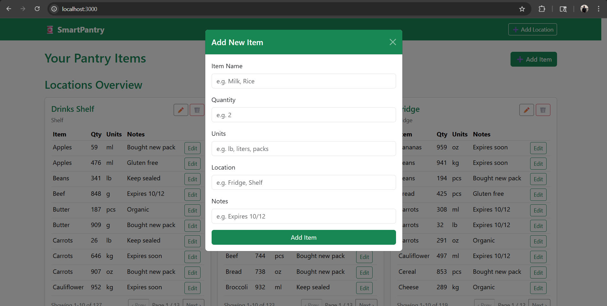

# Personal Homepage — Nakul S

**Author:** Nakul S  
**Class:** MSCS — Web Development Project 2  
**Objective:** Build a full-stack CRUD web application using Node.js, Express, MongoDB, and Vanilla JavaScript to manage household inventory. Users can add, edit, and delete items grouped by storage locations such as Fridge, Pantry, or Shelf.

## What I included
- Two MongoDB collections:
   - items — for pantry item details (name, quantity, units, notes, location)
   - locations — for storage locations (name, type)
- RESTful API built with Express using the native MongoDB driver (no Mongoose)
- Client-side rendering using only Vanilla JS (no frameworks)
- Organized folder structure:
  - /db (MongoDB connection module)
  - /routes (API endpoints for items & locations)
  - /public (frontend scripts, CSS, and HTML)
- Pagination for viewing up to 1,000+ items efficiently
- Cascade rename/delete support between collections
- ESLint & Prettier configuration files included
- MIT License

## How to run locally
1. Unzip or clone the repository.
2. From the project root, install dependencies:
   npm install
3. Ensure MongoDB is running locally on mongodb://localhost:27017.
4. Start the server:
   node server.js
5. Open http://localhost:3000 in your browser.

## Accessibility & Validation
- Semantic HTML structure (header, main, section, footer) used.
- Accessible button labels and color contrast following Bootstrap defaults.
- Fully responsive layout for both desktop and mobile.
- Pagination improves usability for large datasets.
- Keyboard navigation and form validation included.

## GenAI Usage & Attribution
- Tool: **ChatGPT (GPT-5 )** - used to streamline backend logic, pagination handling, and improve documentation clarity.

I used ChatGPT (GPT-5, October 2025) to assist with:
   - Implementing frontend pagination and edit/delete confirmation modals.
   - Generating the README.md, DESIGN_DOCUMENT.md, and LICENSE structure for rubric compliance.
   - Code review and removing unwanted code.

### Example Prompts
- Fix logic so that renaming a location cascades to linked items.
- Show how to render data dynamically and cards can be added in UI with JS
- Create a rubric-ready README for a Node + Mongo full-stack app.
- Review my code and check if statisfies the rubric or not.

All AI-generated code was reviewed, tested, and manually refined before inclusion.

## License
This project is released under the MIT License. See LICENSE.

## Screenshot

## Demo video
Watch a short walkthrough: ![Watch the video]

## How to Use SmartPantry
1. **Add a Location**  
   - Click the “+ Add Location” button on the top right.  
   - Enter a name (e.g., “Fridge”) and a type (e.g., “Cold Storage”).  
   - The new location card will appear instantly on the dashboard.
2. **Add an Item**  
   - Click the “+ Add Item” button.  
   - Fill in the name, quantity, units, notes, and select the location.  
   - The item will appear under its corresponding location card.
3. **Edit Items or Locations**  
   - Click the **Edit** button beside an item or ✏️ icon on a location to rename it.  
   - All linked items update automatically when a location name changes.
4. **Delete Items or Locations**  
   - Click the 🗑️ icon to remove an item or a location.  
   - When a location is deleted, all associated items are also removed.
5. **Pagination**  
   - Use the navigation buttons (“Prev” and “Next”) at the bottom of each location card to browse through large datasets (up to 1,000+ items).
The interface updates instantly using **client-side rendering**, so no page refresh is needed.
